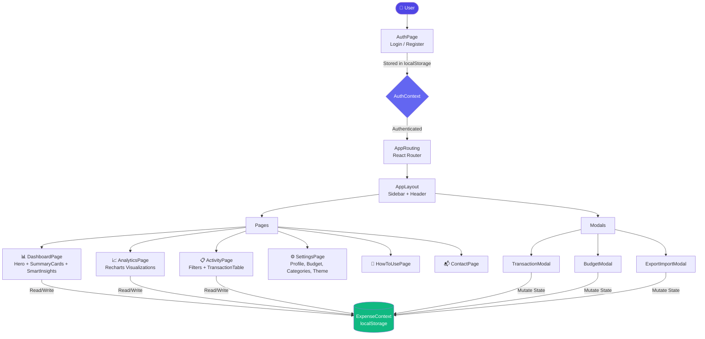

<div align="center" id="top">

<!-- ═══════════════════════════════════════════════════════════ -->
<!--                     HERO BANNER                           -->
<!-- ═══════════════════════════════════════════════════════════ -->


<!-- ═══════════════════════════════════════════════════════════ -->
<!--                   STATUS BADGES                           -->
<!-- ═══════════════════════════════════════════════════════════ -->

<p>
  
  
  
  
  
</p>

<!-- ═══════════════════════════════════════════════════════════ -->
<!--                   TECH STACK BADGES                       -->
<!-- ═══════════════════════════════════════════════════════════ -->

<p>
  
  
  
  
  
  
</p>

<!-- ═══════════════════════════════════════════════════════════ -->
<!--                   QUICK ACTION BUTTONS                    -->
<!-- ═══════════════════════════════════════════════════════════ -->

<p>
  <a href="https://vedantmh48-cpu.github.io/Expense-tracker">
    
  </a>
  &nbsp;
  <a href="https://github.com/vedantmh48-cpu/Expense-tracker/issues/new?template=bug_report.md">
    
  </a>
  &nbsp;
  <a href="https://github.com/vedantmh48-cpu/Expense-tracker/issues/new?template=feature_request.md">
    
  </a>
</p>

<br/>

> **₹upeeFlow** is a smart, privacy-first personal finance tracker built for India — track UPI payments, SIP investments, house rent, and daily expenses with beautiful analytics and zero data leaving your browser.

</div>

---

## 📋 Table of Contents

- [✨ Features](#-features)
- [🖼️ Screenshots](#️-screenshots)
- [🏗️ Architecture](#️-architecture)
- [🛠️ Tech Stack](#️-tech-stack)
- [⚡ Quick Start](#-quick-start)
- [🤝 Contributing](#-contributing)
- [👥 Contributors](#-contributors)
- [📄 License](#-license)

---

## ✨ Features

<table>
<tr>
<td width="50%">

**💰 Smart Transaction Tracking**
- Add income & expense entries in seconds
- 15+ categorized spending categories
- Real-time net balance calculation
- Full transaction history with search & filter

</td>
<td width="50%">

**📊 Powerful Analytics**
- Interactive bar, pie & line charts via Recharts
- Monthly spending trend visualization
- Category-wise expense breakdown
- Income vs. expense comparison views

</td>
</tr>
<tr>
<td width="50%">

**🎯 Budget Management**
- Set monthly spending limits
- Live progress bar with color-coded alerts
- Over-budget & near-limit warnings
- Per-month expense isolation

</td>
<td width="50%">

**🧠 Smart Insights**
- AI-style spending pattern analysis
- Savings rate calculation
- Anomaly detection on unusual spends
- Personalized financial tips

</td>
</tr>
<tr>
<td width="50%">

**📤 Export & Import**
- Export transactions to PDF (jsPDF)
- CSV export for spreadsheet analysis
- Import existing data seamlessly
- Auto-table formatted PDF reports

</td>
<td width="50%">

**🔒 100% Private**
- All data stored in `localStorage`
- Zero backend, zero server calls
- No tracking, no telemetry
- Works fully offline after first load

</td>
</tr>
</table>

---

## 🖼️ Screenshots

<div align="center">

<details>
<summary><b>📸 Click to view App Screenshots</b></summary>

<br/>

| Dashboard Overview | Analytics View |
|:---:|:---:|
|  |  |

| Transaction Feed | Auth Page |
|:---:|:---:|
|  |  |

> 💡 Replace placeholders above with real screenshots from your live app.

</details>

</div>

---

## 🏗️ Architecture



---

## 🛠️ Tech Stack

<details>
<summary><b>🎨 Frontend</b></summary>

<br/>

| Technology | Purpose |
|---|---|
|  | UI framework with hooks & context |
|  | Page-based navigation |
|  | Utility-first styling |
|  | Icon system |
|  | Interactive data visualizations |

</details>

<details>
<summary><b>📦 Libraries & Utilities</b></summary>

<br/>

| Technology | Purpose |
|---|---|
|  | PDF export generation |
|  | Formatted table PDFs |
|  | Global state management |
|  | Client-side persistence |

</details>

<details>
<summary><b>🚀 DevOps & Deployment</b></summary>

<br/>

| Technology | Purpose |
|---|---|
|  | Static site hosting |
|  | Automated deployment |
|  | Build toolchain |

</details>

---

## ⚡ Quick Start

### Prerequisites

Make sure you have the following installed:

```bash
node --version   # v18+ recommended
npm --version    # v9+
git --version
```

### Installation

**1. Clone the repository**

```bash
git clone https://github.com/vedantmh48-cpu/Expense-tracker.git
cd Expense-tracker/et
```

**2. Install dependencies**

```bash
npm install
```

**3. Start the development server**

```bash
npm start
```

Open [http://localhost:3000](http://localhost:3000) in your browser. The app hot-reloads on file changes.

---

### Available Scripts

| Command | Description |
|---|---|
| `npm start` | Run app in development mode |
| `npm run build` | Create optimized production build |
| `npm test` | Launch test runner in watch mode |
| `npm run deploy` | Build & deploy to GitHub Pages |

---

<details>
<summary><b>🔧 Project Structure</b></summary>

```
Expense-tracker/
└── et/
    ├── public/
    │   ├── rupeeflow-logo.svg       # Custom RupeeFlow logo
    │   ├── index.html
    │   └── manifest.json            # PWA manifest
    ├── src/
    │   ├── components/
    │   │   ├── AnalyticsCharts.jsx   # Recharts visualizations
    │   │   ├── AuthPage.jsx          # Login / Register UI
    │   │   ├── BudgetModal.jsx       # Monthly budget setter
    │   │   ├── ExportImportModal.jsx # PDF & JSON export
    │   │   ├── SmartInsights.jsx     # AI-style tips
    │   │   ├── SummaryCards.jsx      # KPI cards
    │   │   ├── TransactionModal.jsx  # Add/edit transactions
    │   │   └── TransactionTable.jsx  # Activity feed
    │   ├── context/
    │   │   ├── AuthContext.js        # Auth state & localStorage
    │   │   └── ExpenseContext.js     # Transactions & budget state
    │   ├── layout/
    │   │   └── AppLayout.jsx         # App shell (sidebar + header)
    │   ├── pages/
    │   │   ├── DashboardPage.jsx     # Dashboard overview
    │   │   ├── AnalyticsPage.jsx     # Analytics view
    │   │   ├── ActivityPage.jsx      # Transaction feed
    │   │   ├── SettingsPage.jsx      # Full settings panel
    │   │   ├── HowToUsePage.jsx      # Guide
    │   │   └── ContactPage.jsx       # Contact form
    │   ├── utils/
    │   │   └── formatters.js         # INR currency formatter
    │   ├── App.js                    # Router-based app
    │   └── index.css                 # Global styles & themes
    └── package.json
```

</details>

<details>
<summary><b>🌐 Deployment to GitHub Pages</b></summary>

<br/>

The `homepage` field in `package.json` is already configured:

```json
"homepage": "https://vedantmh48-cpu.github.io/Expense-tracker"
```

To deploy:

```bash
npm run deploy
```

Then go to **GitHub → Settings → Pages → Branch: `gh-pages` → Save**.

Your app will be live at:
**[https://vedantmh48-cpu.github.io/Expense-tracker](https://vedantmh48-cpu.github.io/Expense-tracker)**

</details>

---

## 🤝 Contributing

Contributions are what make open source amazing. Any contribution you make is **greatly appreciated**.

```
1. 🍴  Fork the Project
        ↓
2. 🌿  Create your Feature Branch
        git checkout -b feature/AmazingFeature
        ↓
3. 💾  Commit your Changes
        git commit -m 'Add some AmazingFeature'
        ↓
4. 📤  Push to the Branch
        git push origin feature/AmazingFeature
        ↓
5. 🔁  Open a Pull Request
```

<details>
<summary><b>📌 Contribution Guidelines</b></summary>

<br/>

- Follow the existing code style (functional components, hooks)
- Keep components small and single-responsibility
- Test your changes locally before submitting a PR
- Write clear, descriptive commit messages
- Link any related issues in your PR description

</details>

---

## 👥 Contributors

<div align="center">

<a href="https://github.com/vedantmh48-cpu/Expense-tracker/graphs/contributors">
  
</a>

<br/><br/>

[](https://star-history.com/#vedantmh48-cpu/Expense-tracker&Date)

</div>

---

## 📄 License

Distributed under the **MIT License**. See [`LICENSE`](./LICENSE) for more information.

---

<div align="center">

<!-- ═══════════════════════════════════════════════════════════ -->
<!--                   AUTHOR CARD                             -->
<!-- ═══════════════════════════════════════════════════════════ -->

**Built with ❤️ for India by Vedant**

<p>
  <a href="https://github.com/vedantmh48-cpu">
    
  </a>
  &nbsp;
  <a href="https://vedantmh48-cpu.github.io/Expense-tracker">
    
  </a>
</p>


<a href="#top">
  
</a>

</div>
